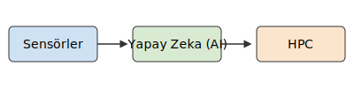

# AutoVal SLAM: A Web-Based Simulation and Perception Prototyping Kit

**AutoVal SLAM: A web-based simulator for autonomous driving, featuring sensor simulation, perception algorithms via Pyodide, and GitHub Pages deployment.** The project runs entirely in your web browser, using **Pyodide** to execute Python simulation code (like NumPy and Matplotlib) via WebAssembly.

This repository is a starting point for experimenting with concepts such as:
-   **In-Browser Sensor Simulation**: Generating and visualizing synthetic sensor data (like LiDAR) directly on a web page.
-   **Web-Based GUI**: Controlling simulation parameters through a user-friendly HTML/CSS interface.
-   **Zero-Installation Deployment**: Sharing the project via a link using automatic GitHub Pages deployment.

## Conceptual Analogy: The Autonomous Driving Orchestra

The system can be compared to a high-precision orchestra working in harmony:



-   **Sensors (Musicians)**: The Python simulation code generates data (musical notes) from virtual sensors.
-   **Web Browser (Conductor & Stage)**: The browser orchestrates the simulation, runs the Python code via Pyodide, and visualizes the output on the screen.
-   **JavaScript (Sound Engineer)**: Acts as the glue, connecting the user interface controls to the Python simulation logic running in the background.

## Features and Enhancements

This project has been significantly enhanced to provide a more interactive and comprehensive simulation environment:

-   **Dynamic Map Generation**: The "Change Map" button now generates complex maze-like environments using a Recursive Backtracking algorithm, providing diverse and challenging scenarios for testing obstacle avoidance.
-   **Random Obstacle Placement**: The "Add Random Obstacles" button populates the map with a random distribution of obstacles and other vehicles, enabling varied simulation setups.
-   **Backend Obstacle Avoidance Algorithms**:
    -   Multiple obstacle avoidance algorithms (e.g., Artificial Potential Field, Bug Algorithms, DWA, RRT, DRL) are implemented in Python (`src/autoval_slam/algorithms.py`).
    -   Users can select an algorithm from the UI, and its logic will drive the vehicle's movement within the simulated environment via Pyodide.
-   **Operational Design Domain (ODD) Integration**:
    -   A dedicated Python parser (`src/autoval_slam/odd_parser.py`) processes ODD XML data to define environmental and operational constraints.
    -   Environmental parameters (e.g., Wind, Rainfall, Snowfall, Illumination, Particulates) are configurable via new UI controls, directly influencing the ODD data.
    -   A text-based visualization of the parsed ODD data is displayed on the webpage using `src/autoval_slam/odd_visualizer.py`, highlighting the simulation's current operational context.
-   **Enhanced User Interface**:
    -   Updated button labels ("Add Obstacle", "Add Vehicle").
    -   Algorithm selection buttons provide visual feedback for the active algorithm.
-   **Improved Simulation Core**:
    -   `main.js` now orchestrates the loading of Python scripts, parsing ODD data, and driving the simulation loop by calling the selected Python algorithm for each movement step.
    -   Collision detection and event logging have been refined to accurately track interactions with obstacles, walls, and other vehicles.

## Project Structure

This project is structured as a static web application that leverages Pyodide.

-   `index.html`: The main entry point and user interface for the web application.
-   `style.css`: Provides styling for the web interface.
-   `main.js`: Contains the core JavaScript logic for loading Pyodide, running Python scripts, and handling user interaction.
-   `src/autoval_slam/sensors.py`: Python module for the 2D LiDAR scanner simulation (runs in the browser).
-   `src/autoval_slam/odd_parser.py`: Python module for parsing ODD XML data.
-   `src/autoval_slam/algorithms.py`: Python module containing implementations/stubs for various obstacle avoidance algorithms.
-   `src/autoval_slam/odd_visualizer.py`: Python module for generating a text-based visualization of ODD data.
-   `src/adcore/sim.py`: Python module for the older camera simulation (currently not implemented in the web UI).
-   `.github/workflows/deploy.yml`: GitHub Actions workflow that automatically deploys the project to GitHub Pages.
-   `docs/diagrams/`: Contains SVG diagrams explaining the project architecture.
-   `placeholder.cpp` & `kalman_adv.py`: Skeletons for future C++ and advanced tracking logic.

## Quick Start & Deployment

This project is designed to be run directly from a web server and is configured for automatic deployment to GitHub Pages.

### Running Locally

To run this project on your local machine, you do not need to install Python dependencies. You only need to serve the files with a simple local web server.

1.  **Clone the repository.**

2.  **Navigate to the `autoval_slam` directory.**

3.  **Start a local web server.** If you have Python installed, the easiest way is:
    ```bash
    # For Python 3
    python -m http.server
    ```
    If you have Node.js installed, you can use:
    ```bash
    npx serve
    ```

4.  **Open your browser** and navigate to `http://localhost:8000` (or the address provided by your server). The web interface should load and initialize Pyodide.

### GitHub Pages Deployment

This repository includes a GitHub Actions workflow that automatically deploys the `main` branch to GitHub Pages.

1.  **Push your code** to the `main` branch of your GitHub repository.
2.  **Enable GitHub Pages** in your repository settings. Go to `Settings -> Pages` and select `GitHub Actions` as the source.
3.  The workflow will run automatically, and your web simulator will be available at `https://<Your-Username>.github.io/<repository-name>/`.

## Future Plans and Out-of-Scope Technologies

Beyond this prototype, certain advanced technologies are targeted for a production-level autonomous driving system but are currently out of scope:

-   **Ceres Solver (SLAM Backend Optimization)**: Notes on this can be found in `placeholder.cpp`.
-   **TensorRT/ONNX (Model Optimization for Real-Time Inference)**: Notes on this are detailed in `src/adcore/hpc/optimization_notes.md`.

## License

This project is licensed under the MIT License. See the `LICENSE.txt` file for details.

## Comprehensive Survey of Obstacle Avoidance Algorithms

This section provides a detailed overview of various obstacle avoidance algorithms, categorized by their underlying principles and approaches.

### I. Classical Geometric and Field-Based Methods (Legacy Methods)

| Algorithm Name | Principle Summary | Core Technologies / Mechanisms Used | Shortcomings / Limitations |
| :---------------------------- | :----------------------------------------------------------------------------------------------------------------- | :------------------------------------------------------------------------------------------------------------------------- | :------------------------------------------------------------------------------------------------------------------------------------------------------ |
| Artificial Potential Field (APF) | Models the environment as a field where the target creates an attractive force and obstacles create repulsive forces. | Modeling of potential fields; attractive force decreases as the robot approaches the target. | Risk of falling into local minima traps or missing the target in certain obstacle configurations (e.g., U-shaped obstacles). |
| Bug Algorithms (General) | Navigates by switching between moving towards the target and following the boundary of an obstacle when encountered. | Navigation in unknown or partially known environments; uses Wall-Following behavior. | Generally not optimal for finding the shortest path; efficiency decreases in complex environments. |
| TangentBug | Detects tangents from range sensors and switches between moving towards the target and navigating around an obstacle. | Uses Range Sensors; switches between Motion-to-Goal and Wall-Following modes. | Guarantees collision avoidance before collision, but requires additional sensor data during planning. |
| CBUG | Implements the Bug1 algorithm within increasing ellipses with a specific area ($A_0$) as an optimal online planner. | Online (real-time) planning; uses Bug1 logic within constrained geometric shapes. | Has fixed memory requirements, but its optimality is limited to the specified area. |
| Virtual Force Field (VFF) | Uses certainty grids modeling obstacles as repulsive forces and averages these forces to determine the resultant motion vector. | Cheap sonar sensors; Models obstacles as Certainty Grids; sonar readings accumulate in grid cells over time. | Risk of robot paralysis (robot becoming immobile) due to repulsive forces of obstacles neutralizing each other. |
| Vector Field Histogram (VFH) | Reduces the certainty grid to a 1D Polar Histogram to quickly identify and select safe movement directions. | Developed to overcome VFF's limitations; uses a polar histogram to find passages. VFH+ is an extension for improved safety. | Can lead to aggressive avoidance behavior in narrow passages or high-speed scenarios. |
| Dynamic Window Approach (DWA) | Samples the feasible velocity space ($v, \omega$) allowed by the robot's dynamic constraints and selects the best velocity pair that can stop before collision. | Considers robot's kinematic constraints; searches for velocity pairs in the velocity space where the robot can stop before collision. | Finds only a local optimum; often suboptimal due to not considering obstacles further ahead. |
| Curvature Velocity Method (CVM) | Converts obstacle constraints into velocity space based on the robot's curvature, considering the robot's kinematic and dynamic constraints. | Considers kinematic and dynamic constraints; maps obstacle constraints to velocity space. ### II. Reinforcement and Deep Learning-Based Methods (RL/DL/DRL)

| Algorithm Name | Principle Summary | Core Technologies / Mechanisms Used | Shortcomings / Limitations |
| :---------------------------------- | :---------------------------------------------------------------------------------------------------------------------- | :--------------------------------------------------------------------------------------------------------------------------------------------------------------------------------------------------------------------------------------------------------------------------------------------------------------------------------------------------------------------------------------------------- | :-------------------------------------------------------------------------------------------------------------------------------------------- |
| Deep Reinforcement Learning (DRL) (General) | Learns an optimal policy through trial and error using neural networks guided by a reward signal. | Policy learning using neural networks; does not require labeled training data, only a reward signal is sufficient. | High training time and inference latency; unacceptable black box nature regarding safety. |
| FERO (Efficient Edge DRL) | Optimizes DRL for low-latency edge devices by reducing the state space and using transfer learning. | State Space Reduction and Transfer Learning; optimized for low latency on edge devices like NVIDIA Jetson. | Initially tested in static environments; adaptation to dynamic scenarios and the balance between speed/success require further work. |
| Dueling Double Deep Q-Network (D3QN) | Estimates the action-value function by separating value and advantage streams in the neural network. | Uses neural networks to estimate the Q-function; used in FERO. | Risk of overestimation bias in action values in DQN and instability during training. |
| Proximal Policy Optimization (PPO) | An on-policy algorithm that constrains the policy update step size to improve training stability. | On-policy algorithm; constrains the surrogate objective function to improve training stability. | Lower sample efficiency compared to off-policy methods. |

### III. Search, Sampling, and Meta-Heuristic Methods

| Algorithm Name | Principle Summary | Core Technologies / Mechanisms Used | Shortcomings / Limitations |
| :-------------------------------------- | :----------------------------------------------------------------------------------------------------------- | :------------------------------------------------------------------------------------------------------------------------------------------------------------------------------------------------------------------------------------------------------------------------------------------------------------------------------------------------------------------------------------------------------- | :------------------------------------------------------------------------------------------------------------- |
| Probabilistic Roadmap (PRM) | Creates a graph (roadmap) in the configuration space by sampling random nodes and connecting collision-free pairs. | Uses random sampling to create a roadmap in high-dimensional configuration spaces. | Can limit robot coverage near obstacles and boundaries due to randomly placed nodes. |
| Rapidly-Exploring Random Tree (RRT) | Incrementally explores the configuration space by building a tree structure biased towards unexplored regions. | Uses a tree structure for rapid exploration; effective for kinodynamic planning. | Does not guarantee an optimal path; the quality of the found path depends on randomness. |
| Ant Colony Optimization (ACO) | A meta-heuristic inspired by the foraging behavior of ants, guiding path selection using pheromones. | Meta-heuristic algorithm inspired by ant behavior; offers parallel computation and robustness. | Slower convergence rates and a tendency to get stuck in local optima. |
| Genetic Algorithms (GA) | A population-based stochastic meta-heuristic that evolves solutions using selection, crossover, and mutation operations. | Population-based stochastic meta-heuristic; part of the Evolutionary Algorithms class. | Performance heavily depends on the correct definition of the fitness function and genetic operators. |

### IV. Special Purpose Systems and Modern Architectural Approaches

| Algorithm Name | Principle Summary | Core Technologies / Mechanisms Used | Shortcomings / Limitations |
| :-------------------------------------- | :---------------------------------------------------------------------------------------------------------------- | :------------------------------------------------------------------------------------------------------------------------------------------------------------------------------------------------------------------------------------------------------------------------------------------------------------------------------------------------------------------------------------------------------------------ | :-------------------------------------------------------------------------------------------------------------------------------------------------------------------------------------------------------- |
| CoDAC (IVO-DWA Integrated) | Designed for USV (Unmanned Surface Vehicle) fleets, using multimodal sensor fusion and a modified DWA compliant with navigation rules (COLREGs). | Designed for USV fleets; Multimodal Fusion; COLREGs compliant IVO-DWA. | The local modularity optimization strategy in DCDM may converge to a globally suboptimal solution. |
| Plastic Recurrent Mushroom Body (PRMB) | A bio-inspired Spiking Neural Network (SNN) using recurrent connections for spatio-temporal memory. | Bio-Inspired SNN architecture; uses a self-decaying dendritic current model. | Addresses the lack of long-term memory in traditional SNNs; however, deployment can be complex. |
| Fuzzy Logic Controller (Agriculture) | Uses a fuzzy rule set to determine reactive collision avoidance actions using different sensor data. | Designed for agricultural mobile robots; Fuzzy Rule Table using data from multi-sensors. | Manual tuning of the Fuzzy Rule Set is difficult, and adaptation to highly complex or dynamic scenarios is challenging. |
| Multiple ML Classifiers (Voting Classifier) | Combines sensor data (Ultrasonic, PIR) and uses an ensemble of classifiers (DT, SVM, KNN, RF) for object detection. | Used in smart knee gloves for the visually impaired; sensor fusion; Ensemble/Voting Classifier. | Sensing range is limited to 4 meters. Some classifiers like GNB may struggle in low light conditions. |
